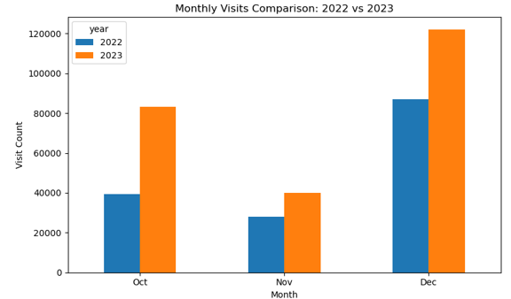

# White House Attendance Analysis



## Project Overview

This project analyzes publicly released White House visitor records from October through December of 2022 and the same three-month period in 2023. It uses Python visualizations to examine recorded activity by month, day of the week, arrival hour, named visitee, and meeting location.

The analysis is intended to support transparent, descriptive review of the available records. It does not determine why a visit occurred, confirm that every recorded access event became a completed visit, or measure an individual's influence or importance.

## Questions Examined

- How did recorded activity vary between the selected 2022 and 2023 months?
- Which named visitees appeared most frequently in the records?
- Which meeting locations were recorded most frequently?
- How did recorded activity vary by day of the week?
- During which hours were recorded arrivals most common?

## Dataset

The repository contains six monthly White House visitor-log files:

- October, November, and December 2022
- October, November, and December 2023

Together, the files contain 399,633 records. The same three-month period was selected from each year to provide a consistent comparison window.

The data originated from the [White House visitor logs](https://bidenwhitehouse.archives.gov/disclosures/visitor-logs/), which were released as public government records.

Important terminology:

- **Visitor:** The person recorded as entering or requesting access.
- **Visitee:** The person listed in the data as being visited.
- **TOA:** The recorded Time of Arrival. It is not independent confirmation that a visit began or was completed at that time.

## Analysis Process

The analysis was completed in Python using a Jupyter Notebook. The process included:

1. Loading and combining the six monthly CSV files.
2. Reviewing columns, record counts, missing values, and date coverage.
3. Converting appointment and arrival fields to datetime values.
4. Creating month, year, day-of-week, and arrival-hour fields.
5. Combining visitee first and last names for frequency analysis.
6. Standardizing meeting-location capitalization, spacing, and hyphenation.
7. Comparing recorded activity across months and years.
8. Examining frequently recorded visitees and meeting locations.
9. Visualizing activity by day of the week and recorded arrival hour.

## Key Findings

- Recorded activity was higher in each selected 2023 month than in the corresponding 2022 month.
- October contained 39,293 records in 2022 and 83,315 in 2023.
- November contained 27,938 records in 2022 and 39,888 in 2023.
- December contained 87,061 records in 2022 and 122,138 in 2023.
- Records with valid arrival times appeared more frequently during late-morning and early-afternoon hours.
- Recorded activity was higher on weekdays than on weekends during the selected periods.
- Some named visitees and standardized meeting locations appeared more frequently than others.

These findings describe only the six selected monthly datasets. They do not establish a complete annual trend, predictable operational demand, unequal access, or the significance of any individual's recorded frequency.

## Visualizations

The notebook includes eight visualizations:

1. White House visits by month
2. Monthly visit comparison for 2022 and 2023
3. Top 10 named visitees
4. Top 10 recorded meeting locations
5. Recorded activity by arrival hour and month
6. Arrival-hour activity scatterplot
7. Recorded visits by day of the week
8. Step-chart comparison of monthly recorded visits

Additional exported charts are available in the [`images`](images/) folder.

## Technologies

- Python
- Jupyter Notebook
- pandas
- Matplotlib

## Repository Contents

| Path | Contents |
|---|---|
| `analysis` | Jupyter Notebook containing the data preparation, analysis, and visualizations |
| `data/WhiteHouseVisitLogs` | Six monthly White House visitor-log CSV files |
| `images` | Exported portfolio visualizations |
| `presentation` | PowerPoint presentation summarizing the analysis |
| `requirements.txt` | Python package requirements |

## Project Materials

- [View the Jupyter Notebook](analysis/WhiteHouseAttendance_Analysis.ipynb)
- [View the PowerPoint presentation](presentation/WhiteHouseAttendanceAnalysis_presentation.pptx)
- [View the exported visualizations](images/)

## Running the Analysis

### Requirements

Install Python 3 and Git. Jupyter Notebook is included in the project requirements.

Clone the repository:

```bash
git clone https://github.com/ferrillt/White-House-Attendance-Analysis.git
```

Move into the repository:

```bash
cd White-House-Attendance-Analysis
```

Install the required packages:

```bash
pip install -r requirements.txt
```

Move into the notebook folder:

```bash
cd analysis
```

Start Jupyter Notebook and open the analysis:

```bash
jupyter notebook WhiteHouseAttendance_Analysis.ipynb
```

Run the notebook cells in order. The notebook loads the six CSV files from the adjacent `data/WhiteHouseVisitLogs` folder, so no path changes are needed when the repository structure is preserved.

## Assumptions and Limitations

- Each row is counted as a recorded visit for analytical purposes.
- The available fields do not independently confirm that every scheduled or recorded access event resulted in a completed visit.
- The analysis covers only October through December of 2022 and 2023 and should not be generalized to either complete calendar year.
- Comparing the same months does not eliminate the effects of holidays, special events, policy changes, or differences in reporting practices.
- Records with missing or unparseable `TOA` values were excluded from arrival-hour visualizations.
- Combining visitee first and last names does not guarantee that identical names represent the same individual.
- Standardized meeting-room labels may combine records that used different formatting for the same apparent location.
- Frequency does not establish purpose, influence, importance, or unequal access.

## Ethical Considerations

The visitor logs are public records, but they contain names and information about real people. The analysis therefore focuses primarily on aggregated patterns and avoids inferring intent, relationships, or political influence. The named-visitee chart represents appearances in the visitee fields and is not a ranking of visitors, influence, or completed meetings.

Data transformations, filters, exclusions, and assumptions are documented in the notebook to reduce the risk of misleading interpretation.

## Potential Enhancements

Future work could:

- Include complete annual records and additional years.
- Compare visitor-log patterns with public event calendars.
- Measure the percentage of records represented by the leading visitees and locations.
- Examine missing arrival-time patterns before interpreting hourly distributions.
- Add interactive filtering by year, month, day, and location.
- Create a reproducible process for updating the analysis when additional records become available.

## Author

Teresa Ferrill
